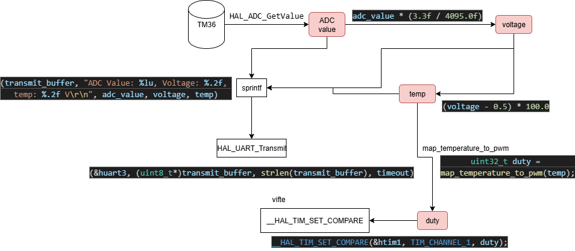

## Prosjektbeskrivelse

forts av TMP36 repo
----------#######---------------
Oppgaven går ut på å lese analoge data fra en TMP36 temperatursensor via ADC, konvertere ADC-verdien til spenning og deretter til temperatur i Celsius, og sende disse dataene kontinuerlig over UART til en PC.

- Sensoren er koblet til 3.3V, GND og pin PA3 som analog inngang, og UART brukes på pin PD9 for RX og PD8 for TX for seriell kommunikasjon med PC.
- build flags er oppdatert for å tillate bruk av float i sprintf  build_flags = -IInc -Wall -Wl,-u,_printf_float
- det er lagd en void MX_USART3_UART_Init(void) funksjon som initaliserer usart kommunikasjon, hvor denne ikke var definert eller deklarert per default
--------########----------------

NYTT
dette bygger videre på siste Repo og implementerer bruk av en DC motor som fan ved hjelp av en LM293D H-Brigde
koblingen er likt som [exercise 1](https://fjnn.github.io/hvl-ele201/lectures/l7-motordrive#exercise-1-simple-dc-motor-drive-with-l293d) bare uten knapp og potentiometer

flow

